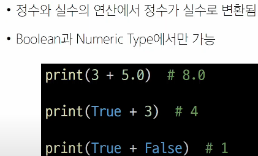
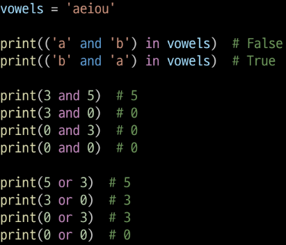
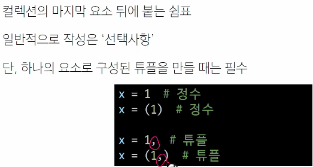
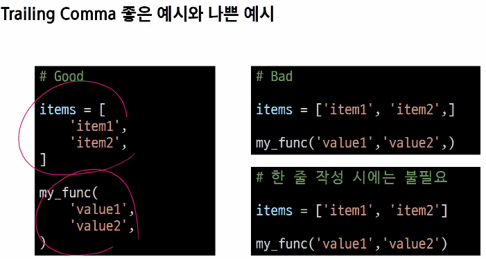

# TIL 쓰기 2일차

## 복습시간
TIL을 쓸 때는 요약만 하지마라 **스스로 찾은 것의 기록**이 필요하다
>그럼 일단 요약하고 맘속소리를 blockquotes로 표현해서 혼자 찾은 걸 뒤에 붙여야겠다다

## 수업 요약
<details>
<summary>필기니까 접어놓기</summary>
   
### Sequence Types(str, list, tuple, range)
- #### Features   
1. Sequence (순차차)   
2. indexting
   + 파이썬의 특징 : -1의 인덱스는 맨 뒤부터 시작
4. Slicing
   + [1:2:-1] = [시작점:끝점:체크길이(-1이면 뒤로 한칸씩)]
6. Length   
7. Iteration (반복)
   > Iterable하다의 의미 -> for while에 쓸 수 있다  
   확인하는 방법은  VScode에서 [].을 하면 밑에 \__iter\__ 가 있을 경우

- #### str 
  문자들이고 불변 ',"   
  따옴표 안에 따옴표 쓸 때 둘 다 활용 or \', \" 사용   
- #### list   
  대괄호, 어떤 자료형도 저장 가능  
  **가변적**이다. 왜??  
    
  리스트는 값들이 들어간 메모리의 주소를 가지고 있는 자료형이라 가변적일 수 있다!  
- #### tuple
  list와 거의 같지만 ()로 사용하고 불변
  개발자보다 내부 동작에 사용하는 경우가 많음
- #### range
  연속된 정수 시퀀스를 **생성**, 불변
  ```
  range(시작, 끝, 증가 값)
  ```
---
### Non-squence Types
- #### dict
  key - vaule, 순서 중복 없음, 가변  
  ※**key**에는 **불변**데이터만  
  {'key' : 'value'} 형태  
  추가와 변경의 경우  

  
- #### set
  집합 자료형이라 표현도 함(연산가능), 순서 중복 없음, 가변, {} 형태여서 빈 세트는 무조건 set().  
  집합 연산이 가능하다!!  
  > 어 그럼 combiantion(조합) 구현할 떄 중복제외 가능할 거 같다
  

- #### None, Boolean
  값이 없다를 표현하는 자료형  
  True, False 표현하는 자료형 (True == 1. False == 0)


### Type Conversiton(형변환)
- 한 데이터를 다른 타입으로 바꾸기  
- Implicit(암시적) 형변환?  



더 큰 집합으로 바뀐다 실수 - 정수의 경우 실수로  
if문 int -> 0말고는 다 참, str -> 빈 경우 말고는 True, list도 마찬가지  

- Explicit(명시적) 형변환?  

str -> int 따위  
> 찾아보니 list tuple set은 왔다갔다 가능  
아무래도 조합 구현하려고 하면 활용 가능할듯

### 복합연산자
- +=, -=, *=, /=, //=, %=, **=

### 비교연산자
- <, <=, >, >=
- ==, !=, is, is not  
==는 값(+타입)이 같은지를 비교. 따라서 1 == True는 True.  
is는 '객체'가 같은지를 비교한다. 즉 같은 메모리 주소(레퍼런스)를 가르킬때만 ok함  
따라서 값이 같아도 오류가 날 수 있다.  
Q : 그럼 언제 쓸까?  
A : Singleton 객체일때만! (프로그램 전체에서 오직 1개만 있는)  
ex) None True False
+ 특정 정수 세트(-100~100인가? 아무튼 작은 크기)는 아예 메모리에서 주소할당을 미리 해놨다  
  많이 써서 그래서 계산을 걸어도 주소 안 달라짐

### 논리연산자
- and
T and T 일때만 T
- or
F or F 일때만 F
- not
not 0 == True

### 단축평가
논리 연산에서 두 번째 피연산자를 평가 하지 않고 결과를 결정하는 동작  

  

앞에서 결정나기 때문에 코드가 꼬일 수 있으니 조심해야한다  

+강사님의 첨언  
ㅁ의 메모리에 3 and 5가 주어지면 3이 들어갔다가 T니까 다음 5가 들어가서 5가 남는 거  
중요한 이유는 IF 연산-결과 AND 연산-결과일 때  
각 연산 결과를 끝까지 진행안해서 값이 (꼬일 수 있다?)


### 멤버십 연산자
-in, not in  
시퀀스나 컬렉션에 속하는지 확인

### 시퀀스형 연산자
- +:결합연산자, *:반복연산자

### Trailing Comma



작성시 더 들어올 걸 대비하는? 느낌?  
파이썬과 자바스크립트에서는 인정해줌 다른 건 컴파일 에러남  
Data 특화라서 길어지는 데이터를 다룰 수 있으니 스크롤 길 때 편리하라고 만든 거


## 강사님의 리뷰
cs와 연결 하는 마인드 - 메모리  

리스트 - 각 주소를 하나씩 처리하기 때문에 자유롭지만   
다른 언어에서는 처음부터 int(10)과 같이 하나의 타입, 크기 전부 배정해야한다  
대신 이 경우 메모리에게 할당하는 크기를 int 하나당 4바이트씩 40바이트를 배정할 수 있음  
따라서 빠르다 파이썬은 비교적 느리다  

튜플 - 타 언어에서는 임시저장소의 개념으로 변수를 하나 사용  
파이썬에선 내부 언어에서 튜플을 임시저장소로 사용  
값 교환 >> 파이썬이 제공하는 특징 x, y = y, x  
for item in dict.values(),dict.keys() -> 각 형태가 따로 있어서 list() 씌워줘야함    

is 생각보다 쓴다 - 원본이 있을 때 복사본으로 작업하다 원본으로 넣는 작업이 많아서 확인차   

연산자 우선순위는 거듭제곱이랑 단항연산자(+-)가 다른 것보다 우선이다  
논리연산보다 계산이 우선(왜냐하면 참거짓을 먼저로 뒀을 때 참거짓 처리하고 사칙연산? 불편함)


<!-- summary 아래 한칸 공백 두어야함 -->
</details>

## 진짜 TIL
#### 얕은 복사와 깊은 복사  
이미 한 번 해서 알고는 있었으니 .copy()가 아니라 import를 쓴 버전이었다  
그래서 https://crackerjacks.tistory.com/14  
여기를 참조하여 깊은 복사를 하는 법 = .copy() 배움  

#### SWEA 풀면서 얻은 것들
- .upper(), .lower()   
대문자 소문자로 전부 확인해서 바꿔주는 함수  
- sum(list)   
  리스트 전부 더하기 가능
- 알파벳 to 숫자 dict 제작, 함수 ord()  

#### 취업특강
- 자기소개서 ai첨삭 가능
- 취업 컨설턴트분과 쭉 같이 함
- 직업선호도검사, 직업가치관검사 RIASEC 기억
- 역경의 반댓말은 경력 = 힘든일 있으면 기록해라


#### 보충학습
